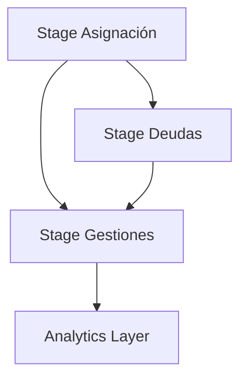

# Pipeline de Datos FACO - Gestión de Cobranzas

## 🎯 Visión General

Pipeline de datos estructurado en 3 capas para la gestión y reportería de cobranzas, diseñado para procesar, analizar y presentar información de manera sistemática y escalable.

## 🏗️ Arquitectura

```
📁 faco_pipeline/
├── 📁 stages/
│   ├── 📁 01_staging/          # Capa de Staging
│   │   ├── ✅ asignacion/      # Stage de asignación de cartera
│   │   ├── ✅ deudas/          # Stage de deudas con lógica FECHA_TRANDEUDA
│   │   └── 🔄 gestiones/       # Stage de gestiones (en desarrollo)
│   ├── 📁 02_analytics/        # Capa Analítica  
│   └── 📁 03_presentation/     # Capa de Presentación
├── 📁 config/                 # Configuración del pipeline
├── 📁 utils/                  # Utilidades y herramientas
└── 📁 docs/                   # Documentación
```

## 🚀 Estado Actual

### ✅ **Completado**
- [x] **Stage de Asignación**: Detección automática, merge inteligente, tests de calidad
- [x] **Stage de Deudas**: Lógica FECHA_TRANDEUDA, construcción de fechas, medibilidad precisa
- [x] **Sistema de Logging**: Trazabilidad completa de procesos
- [x] **Tests de Calidad**: Validaciones automáticas para ambos stages
- [x] **Documentación**: Especificaciones técnicas detalladas

### 🔄 **En Desarrollo**
- [ ] Stage de Gestiones
- [ ] Stage de Pagos
- [ ] Capa Analítica

## 🎯 **Funcionalidades Principales**

### **Stage de Asignación**
- **Detección automática** de archivos por fecha de proceso
- **Categorización inteligente** de vencimientos y carteras
- **Objetivos de recupero** parametrizados por reglas de negocio
- **Merge optimizado** con preservación de histórico

### **Stage de Deudas** 
- **Lógica de medibilidad** basada en coincidencia con FECHA_TRANDEUDA
- **Construcción de fechas** desde archivos TRAN_DEUDA_DDMM
- **Diferenciación** entre clientes gestionables vs medibles
- **Filtrado inteligente** para competencia y gestión

### **Características Técnicas**
- **Idempotencia**: Procesos re-ejecutables sin duplicados
- **Particionado**: Optimización temporal por fecha
- **Clustering**: Mejora performance en consultas frecuentes
- **Logging centralizado**: Monitoreo completo de ejecuciones

## 🔧 **Uso Básico**

### **Pipeline Diario Automático**
```sql
-- 1. Procesar asignaciones del día
CALL `BI_USA.bi_P3fV4dWNeMkN5RJMhV8e_sp_asignacion`();

-- 2. Procesar deudas (requiere asignaciones)
CALL `BI_USA.bi_P3fV4dWNeMkN5RJMhV8e_sp_deudas`();
```

### **Procesamiento de Fecha Específica**
```sql
-- Pipeline completo para fecha específica
DECLARE fecha_proceso DATE DEFAULT '2025-06-19';

CALL `BI_USA.bi_P3fV4dWNeMkN5RJMhV8e_sp_asignacion`(fecha_proceso);
CALL `BI_USA.bi_P3fV4dWNeMkN5RJMhV8e_sp_deudas`(fecha_proceso);
```

## 📊 **Métricas y Monitoreo**

### **Logging Centralizado**
- Tabla: `BI_USA.pipeline_logs`
- Métricas: Duración, registros procesados, errores
- Negocio: Archivos detectados, gestionabilidad, medibilidad

### **Tests de Calidad**
- **Asignación**: 5 tests automatizados
- **Deudas**: 9 tests específicos + validación FECHA_TRANDEUDA
- **Umbral**: 95% success rate mínimo

## 🎯 **Lógica de Negocio**

### **Regla Crítica de Medibilidad (Deudas)**
Un cliente es **MEDIBLE** solo cuando:
1. ✅ Tiene asignación (`es_gestionable = TRUE`)
2. ✅ La fecha del archivo TRAN_DEUDA coincide con `FECHA_TRANDEUDA` del calendario

### **Tipos de Cartera (Asignación)**
- **TEMPRANA**: Gestión preventiva
- **CUOTA_FRACCIONAMIENTO**: Cuotas fraccionadas
- **ALTAS_NUEVAS**: Clientes nuevos
- **OTRAS**: Demás tipologías

### **Objetivos de Recupero**
- AL VCTO: 15%
- ENTRE 4 Y 15D: 25%
- TEMPRANA: 20%
- DEFAULT: 20%

## 🛠️ **Tecnologías**

- **BigQuery**: Base de datos y procesamiento
- **SQL**: Stored Procedures y transformaciones
- **YAML**: Configuración del pipeline
- **Regex**: Construcción de fechas desde archivos

## 📈 **Optimizaciones Implementadas**

### **Performance**
- Particionado por fechas clave
- Clustering por campos de consulta frecuente
- Detección automática de archivos

### **Calidad de Datos**
- Validaciones automáticas post-proceso
- Tests específicos de lógica de negocio
- Alertas de inconsistencias

### **Mantenibilidad**
- Configuración centralizada en YAML
- Documentación técnica completa
- Ejemplos de uso prácticos

## 🔗 **Dependencias**



## 📚 **Documentación**

- **Especificaciones técnicas** por stage
- **Ejemplos de uso** prácticos
- **Tests de calidad** automatizados
- **Guías de troubleshooting**

---

## 🚀 **Próximos Pasos**

1. ✅ ~~Implementar stage de asignación~~
2. ✅ ~~Implementar stage de deudas con lógica FECHA_TRANDEUDA~~
3. 🔄 **Desarrollar stage de gestiones**
4. 📋 Construir capa analítica
5. 📋 Crear dashboards en Looker Studio

---

**Versión**: 1.2.0  
**Equipo**: FACO Team  
**Última actualización**: 2025-06-19  
**Cambio crítico**: Medibilidad basada en FECHA_TRANDEUDA
