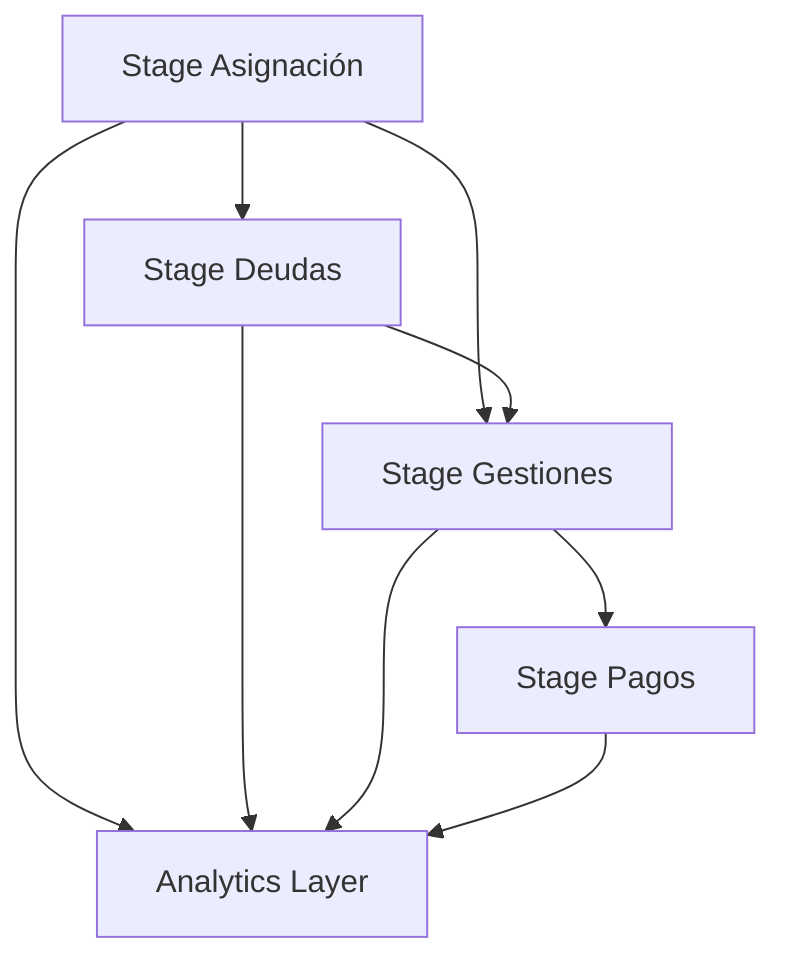

# Pipeline de Datos FACO - Gestión de Cobranzas

## 🎯 Visión General

Pipeline de datos estructurado en 3 capas para la gestión y reportería de cobranzas, diseñado para procesar, analizar y presentar información de manera sistemática y escalable.

## 🏗️ Arquitectura

```
📁 faco_pipeline/
├── 📁 stages/
│   ├── 📁 01_staging/          # Capa de Staging
│   │   ├── ✅ asignacion/      # Stage de asignación de cartera
│   │   ├── ✅ deudas/          # Stage de deudas con lógica FECHA_TRANDEUDA
│   │   ├── ✅ gestiones/       # Stage de gestiones BOT + HUMANO
│   │   └── 🔄 pagos/           # Stage de pagos (próximo)
│   ├── 📁 02_analytics/        # Capa Analítica  
│   └── 📁 03_presentation/     # Capa de Presentación
├── 📁 config/                 # Configuración del pipeline
├── 📁 utils/                  # Utilidades y herramientas
└── 📁 docs/                   # Documentación
```

## 🚀 Estado Actual

### ✅ **Completado - Capa de Staging**
- [x] **Stage de Asignación**: Detección automática, merge inteligente, categorización
- [x] **Stage de Deudas**: Lógica FECHA_TRANDEUDA, construcción de fechas, medibilidad precisa
- [x] **Stage de Gestiones**: Unificación BOT+HUMANO, homologación, métricas de efectividad
- [x] **Sistema de Logging**: Trazabilidad completa de procesos
- [x] **Tests de Calidad**: 24 validaciones automáticas totales
- [x] **Documentación**: Especificaciones técnicas completas

### 🔄 **En Desarrollo**
- [ ] Stage de Pagos
- [ ] Capa Analítica
- [ ] Dashboards en Looker Studio

## 🎯 **Funcionalidades Principales**

### **🔄 Pipeline Completo de Staging**

#### **1. Stage de Asignación**
- **Detección automática** de archivos por fecha de proceso
- **Categorización inteligente** de vencimientos y carteras
- **Objetivos de recupero** parametrizados por reglas de negocio
- **Merge optimizado** con preservación de histórico

#### **2. Stage de Deudas** 
- **Lógica de medibilidad** basada en coincidencia con FECHA_TRANDEUDA
- **Construcción de fechas** desde archivos TRAN_DEUDA_DDMM
- **Diferenciación** entre clientes gestionables vs medibles
- **Filtrado inteligente** para competencia y gestión

#### **3. Stage de Gestiones**
- **Unificación BOT + HUMANO** con homologación completa
- **Métricas de efectividad** automáticas por canal
- **Compromisos y conversión** con validación de montos
- **Secuencia de gestiones** por cliente y día

### **🔧 Características Técnicas**
- **Idempotencia**: Procesos re-ejecutables sin duplicados
- **Particionado**: Optimización temporal por fecha
- **Clustering**: Mejora performance en consultas frecuentes
- **Logging centralizado**: Monitoreo completo de ejecuciones
- **Homologación**: Estandarización de respuestas y operadores

## 🔧 **Uso Básico**

### **Pipeline Diario Completo**
```sql
-- Pipeline automático de 3 stages
DECLARE fecha_proceso DATE DEFAULT CURRENT_DATE();

-- 1. Asignación (base de clientes)
CALL `BI_USA.bi_P3fV4dWNeMkN5RJMhV8e_sp_asignacion`(fecha_proceso);

-- 2. Deudas (requiere asignación para medibilidad)
CALL `BI_USA.bi_P3fV4dWNeMkN5RJMhV8e_sp_deudas`(fecha_proceso);

-- 3. Gestiones (requiere asignación y deudas)
CALL `BI_USA.bi_P3fV4dWNeMkN5RJMhV8e_sp_gestiones`(fecha_proceso);
```

### **Ejecución Individual por Stage**
```sql
-- Solo asignaciones
CALL `BI_USA.bi_P3fV4dWNeMkN5RJMhV8e_sp_asignacion`();

-- Solo deudas
CALL `BI_USA.bi_P3fV4dWNeMkN5RJMhV8e_sp_deudas`();

-- Solo gestiones BOT
CALL `BI_USA.bi_P3fV4dWNeMkN5RJMhV8e_sp_gestiones`(CURRENT_DATE(), 'BOT');
```

## 📊 **Métricas y Monitoreo**

### **Logging Centralizado**
- **Tabla**: `BI_USA.pipeline_logs`
- **Métricas**: Duración, registros procesados, errores
- **Negocio**: Archivos detectados, medibilidad, efectividad, homologación

### **Tests de Calidad Automatizados**
- **Asignación**: 5 tests automatizados
- **Deudas**: 9 tests específicos + validación FECHA_TRANDEUDA
- **Gestiones**: 10 tests + análisis de homologación
- **Umbral global**: 95% success rate mínimo

### **Dashboard de Efectividad**
```sql
SELECT 
  canal_origen,
  COUNT(*) as total_gestiones,
  COUNT(CASE WHEN es_contacto_efectivo THEN 1 END) as efectivos,
  ROUND(COUNT(CASE WHEN es_contacto_efectivo THEN 1 END) / COUNT(*) * 100, 2) as pct_efectividad
FROM `BI_USA.bi_P3fV4dWNeMkN5RJMhV8e_stg_gestiones`
WHERE fecha_proceso = CURRENT_DATE()
GROUP BY canal_origen;
```

## 🎯 **Lógica de Negocio**

### **Regla Crítica de Medibilidad (Deudas)**
Un cliente es **MEDIBLE** solo cuando:
1. ✅ Tiene asignación (`es_gestionable = TRUE`)
2. ✅ La fecha del archivo TRAN_DEUDA coincide con `FECHA_TRANDEUDA` del calendario

### **Homologación de Gestiones**
- **BOT**: Homologación por `management + sub_management + compromiso`
- **HUMANO**: Homologación por `management` y `nombre_agente`
- **Resultado**: Respuestas unificadas en `grupo_respuesta`, `nivel_1`, `nivel_2`

### **Efectividad y Conversión**
- **Contacto Efectivo**: Patterns `%CONTACTO_EFECTIVO%`, `%EFECTIVO%`
- **Compromiso**: Flag PDP homologado + monto/fecha validados
- **Conversión**: % Compromisos / Contactos Efectivos

### **Tipos de Cartera y Objetivos**
- **TEMPRANA**: 20% objetivo recupero
- **CUOTA_FRACCIONAMIENTO**: Gestión especializada
- **ALTAS_NUEVAS**: 20% objetivo recupero
- **AL VCTO/ENTRE 4 Y 15D**: 15%/25% objetivos específicos

## 🛠️ **Tecnologías**

- **BigQuery**: Base de datos y procesamiento
- **SQL**: Stored Procedures y transformaciones complejas
- **YAML**: Configuración centralizada del pipeline
- **Regex**: Construcción de fechas desde archivos
- **JSON**: Logging estructurado de parámetros

## 📈 **Optimizaciones Implementadas**

### **Performance**
- **Particionado** por fechas clave (asignación, deuda, gestión)
- **Clustering** por campos de consulta frecuente
- **Detección automática** de archivos y canales
- **Merge inteligente** con preservación de histórico

### **Calidad de Datos**
- **24 tests automatizados** across all stages
- **Validaciones específicas** de lógica de negocio
- **Alertas de inconsistencias** en tiempo real
- **Métricas de homologación** por canal

### **Mantenibilidad**
- **Configuración centralizada** en YAML
- **Documentación técnica** detallada por stage
- **Ejemplos de uso** prácticos
- **Troubleshooting guides** específicos

## 🔗 **Dependencias y Flujo**



### **Secuencia Obligatoria**
1. **Asignación** → Base de clientes asignados
2. **Deudas** → Requiere asignación para gestionabilidad
3. **Gestiones** → Requiere asignación y deudas para medibilidad

## 📚 **Documentación**

- **Especificaciones técnicas** detalladas por stage
- **Ejemplos de uso** prácticos y casos reales
- **Tests de calidad** automatizados
- **Guías de troubleshooting** específicas
- **Configuración centralizada** documentada

## 📊 **Métricas de Negocio Clave**

### **Asignación**
- Clientes asignados por tipo de cartera
- Objetivos de recupero por segmento
- Distribución por vencimientos

### **Deudas**
- % Medibles por coincidencia FECHA_TRANDEUDA
- Montos gestionables vs medibles
- Cobertura de calendario

### **Gestiones**
- % Efectividad por canal (BOT vs HUMANO)
- % Conversión a compromisos
- % Homologación de respuestas
- Ranking de operadores

---

## 🚀 **Próximos Pasos**

1. ✅ ~~Implementar stage de asignación~~
2. ✅ ~~Implementar stage de deudas con lógica FECHA_TRANDEUDA~~
3. ✅ ~~Implementar stage de gestiones con unificación BOT+HUMANO~~
4. 🔄 **Desarrollar stage de pagos**
5. 📋 Construir capa analítica con KPIs
6. 📋 Crear dashboards en Looker Studio

---

**Versión**: 1.3.0  
**Equipo**: FACO Team  
**Última actualización**: 2025-06-19  
**Estado**: 3 stages de staging completados  
**Cambios recientes**: Stage de gestiones con homologación completa
