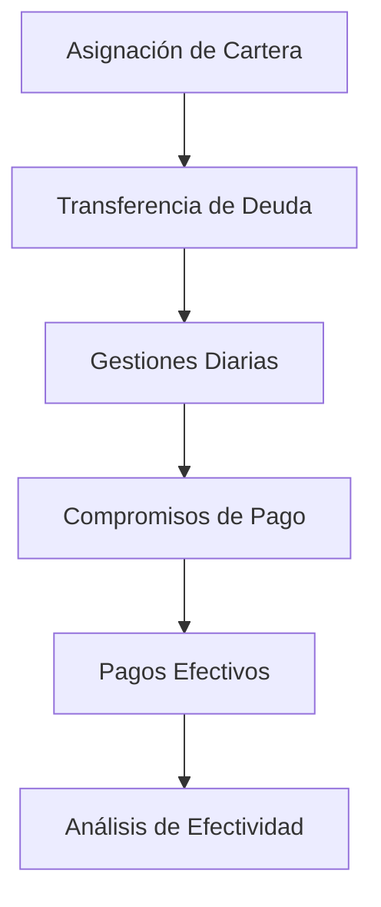

# 📚 Dominio de Gestión de Cobranzas FACO - Knowledge Base

## 🎯 Visión General del Dominio

El **pipeline de gestión de cobranzas FACO** es un sistema de datos diseñado para procesar, analizar y reportar actividades de cobro a través de múltiples canales (BOT y HUMANO). El sistema maneja el ciclo completo desde la asignación de carteras hasta el seguimiento de efectividad de gestiones.

## 🏗️ Arquitectura del Negocio

### **Flujo Principal del Negocio**


### **Entidades Principales**

#### **1. CARTERA** 
- **Propósito**: Segmentación de clientes por estrategia de cobro
- **Tipos**:
  - `TEMPRANA`: Gestión preventiva antes del vencimiento
  - `CUOTA_FRACCIONAMIENTO`: Clientes con cuotas fraccionadas
  - `ALTAS_NUEVAS`: Clientes recientemente incorporados
  - `OTRAS`: Demás tipologías
- **Identificación**: Por nombre de archivo de asignación

#### **2. CLIENTE**
- **Identificación**: `cod_luna` (único en sistema)
- **Contexto**: Puede estar en múltiples carteras simultáneamente
- **Estados**: Asignado, Con Deuda, Gestionado, Con Compromiso
- **Características**: Zona geográfica, segmento de gestión, vencimientos

#### **3. ASIGNACIÓN**
- **Función**: Determina qué clientes son **gestionables**
- **Temporalidad**: Se asigna en `FECHA_ASIGNACION` del calendario
- **Criterios**: Segmento de gestión, zona, tipo de cartera
- **Impacto**: Base para determinar población gestionable

#### **4. DEUDA**
- **Función**: Determina qué clientes son **medibles** para competencia
- **Temporalidad**: Archivos `TRAN_DEUDA_DDMM` diarios
- **Criterio de Medibilidad**: Coincidencia `fecha_archivo = FECHA_TRANDEUDA`
- **Lógica**: Solo clientes con deuda en relación específica cuentan para métricas

#### **5. GESTIÓN**
- **Canales**: BOT (voicebot) y HUMANO (mibotair)
- **Escalas de Peso**: Diferentes por canal, requieren normalización
- **Outcomes**: Contacto, Compromiso, Sin Contacto
- **Contexto**: Incluye información de cartera y vencimientos

## 🧠 Lógica de Negocio Crítica

### **Conceptos Clave**

#### **🎯 GESTIONABILIDAD**
- **Definición**: Cliente que puede ser gestionado por tener asignación
- **Criterio**: `tiene_asignacion = TRUE`
- **Impacto**: Base para calcular universo de gestión

#### **📊 MEDIBILIDAD** 
- **Definición**: Cliente que cuenta para métricas de competencia
- **Criterio**: `es_gestionable = TRUE` AND `fecha_deuda = FECHA_TRANDEUDA`
- **Importancia**: **Solo estos clientes miden para efectividad**
- **Lógica**: Cliente debe estar "con deuda pendiente en dicha relación"

#### **⚖️ PESO DE GESTIÓN**
- **BOT**: Rango -960 a 31 (negativos = discador automático)
- **HUMANO**: Rango -2 a 122 (mayormente positivos)
- **Desafío**: Escalas diferentes requieren normalización para competir
- **Solución Implementada**: Marcadores separados por canal en staging

### **Reglas de Temporalidad**

#### **📅 DÍA DE APERTURA vs DÍAS SUBSIGUIENTES**
- **Día Apertura**: `fecha_proceso = FECHA_ASIGNACION`
  - Se filtran clientes "gestionables y medibles"
  - Base para medición de efectividad
- **Días Subsiguientes**: `fecha_proceso ≠ FECHA_ASIGNACION`
  - Pueden sumarse/activarse nuevas deudas
  - No cuentan para competencia (es_medible = FALSE)

#### **🔄 CONSTRUCCIÓN DE FECHAS**
- **Archivos TRAN_DEUDA**: Formato `TRAN_DEUDA_DDMM`
- **Extracción**: Regex para construir fecha desde nombre
- **Ejemplo**: `TRAN_DEUDA_1906` → `2025-06-19`
- **Join Crítico**: `fecha_construida = FECHA_TRANDEUDA`

### **Sistema de Objetivos de Recupero**

#### **📈 Objetivos por Segmento**
| Segmento | Objetivo | Justificación |
|----------|----------|---------------|
| `AL VCTO` | 15% | Gestión preventiva, menor urgencia |
| `ENTRE 4 Y 15D` | 25% | Ventana crítica de cobranza |
| `TEMPRANA` | 20% | Estrategia proactiva |
| **DEFAULT** | 20% | Objetivo estándar |

### **Categorización de Vencimientos**

#### **🕐 Buckets Temporales**
```sql
CASE
  WHEN min_vto IS NULL THEN 'SIN_VENCIMIENTO'
  WHEN min_vto <= CURRENT_DATE() THEN 'VENCIDO'
  WHEN min_vto <= CURRENT_DATE() + 30 THEN 'POR_VENCER_30D'
  WHEN min_vto <= CURRENT_DATE() + 60 THEN 'POR_VENCER_60D'
  WHEN min_vto <= CURRENT_DATE() + 90 THEN 'POR_VENCER_90D'
  ELSE 'VIGENTE_MAS_90D'
END
```

## 📊 Métricas y KPIs del Negocio

### **Efectividad de Gestión**
- **Contactabilidad**: % de gestiones con contacto efectivo
- **Compromiso**: % de gestiones que generan compromiso
- **Cumplimiento**: % de compromisos que se pagan
- **Recupero**: Monto recuperado / Monto gestionable

### **Análisis de Canales**
- **Comparativa BOT vs HUMANO**: Post-normalización de pesos
- **Efectividad por Canal**: Considerando escalas diferentes
- **Costo por Gestión**: ROI por canal de gestión

### **Análisis de Carteras**
- **Performance por Tipo**: TEMPRANA vs FRACCIONAMIENTO vs OTRAS
- **Efectividad por Segmento**: AL VCTO vs ENTRE 4 Y 15D
- **Análisis Temporal**: Día apertura vs días subsiguientes

## 🎯 Casos de Uso Específicos

### **Escenario 1: Cliente en Múltiples Carteras**
```
Cliente 12345 está en:
- Cartera TEMPRANA (archivo: TEMP_1906.txt)
- Cartera FRACCIONAMIENTO (archivo: CF_ANN_1906.txt)

Tratamiento:
- Cada combinación (cliente, cartera) se trata independientemente
- Puede ser gestionable en una y no en otra
- Métricas se calculan por combinación cliente+cartera
```

### **Escenario 2: Medibilidad por FECHA_TRANDEUDA**
```
Archivo: TRAN_DEUDA_1906 → fecha_construida = 2025-06-19
Calendario: FECHA_TRANDEUDA = 2025-06-19
Cliente: Tiene asignación
Resultado: es_medible = TRUE (cuenta para competencia)

Archivo: TRAN_DEUDA_2006 → fecha_construida = 2025-06-20  
Calendario: Sin FECHA_TRANDEUDA = 2025-06-20
Cliente: Tiene asignación
Resultado: es_medible = FALSE (no cuenta para competencia)
```

### **Escenario 3: Gestiones BOT vs HUMANO**
```
Cliente 12345 - Día 2025-06-19:
- Gestión BOT: weight = -50 (discador)
- Gestión HUMANO: weight = 15 (agente)

Stage Gestiones:
- es_mejor_gestion_bot_dia = TRUE (para la de weight -50)
- es_mejor_gestion_humano_dia = TRUE (para la de weight 15)

Capa Analytics (futura):
- Normalización y competencia BOT vs HUMANO
- Determinación de mejor gestión global del día
```

## 🔄 Dependencias y Secuencias

### **Orden de Ejecución Requerido**
1. **ASIGNACIÓN** → Establece base de clientes gestionables
2. **DEUDAS** → Requiere asignación para determinar medibilidad  
3. **GESTIONES** → Requiere contexto de asignación y deudas
4. **PAGOS** → Vinculado a gestiones y compromisos

### **Relaciones entre Entidades**
```sql
-- Asignación → Deudas
asignacion.cod_cuenta = deudas.cod_cuenta
asignacion.fecha_asignacion = calendario.FECHA_ASIGNACION

-- Deudas → Calendario  
deudas.fecha_construida = calendario.FECHA_TRANDEUDA

-- Gestiones → Asignación
gestiones.cod_luna = asignacion.cod_luna

-- Gestiones → Deudas
gestiones.cod_luna = deudas.cod_cuenta (via conversión)
```

## 🎛️ Configuraciones del Negocio

### **Archivos y Patrones**
- **Asignación**: Detección automática por `FECHA_ASIGNACION`
- **Deudas**: Patrón `TRAN_DEUDA_DDMM`
- **Gestiones**: Tablas `voicebot_*` y `mibotair_*`

### **Calendarios y Fechas Clave**
- **FECHA_ASIGNACION**: Cuándo se asigna la cartera
- **FECHA_TRANDEUDA**: Cuándo el cliente es medible
- **FECHA_CIERRE**: Límite de gestión de cartera
- **DIAS_GESTION**: Ventana disponible para gestionar

## 🚨 Reglas de Negocio Críticas

### **⚠️ NUNCA hacer**
1. **No mezclar escalas BOT-HUMANO** sin normalizar
2. **No considerar medible** cliente sin coincidencia FECHA_TRANDEUDA
3. **No incluir días subsiguientes** en métricas de competencia
4. **No ignorar llave compuesta** cliente+cartera

### **✅ SIEMPRE hacer**
1. **Ejecutar en secuencia**: Asignación → Deudas → Gestiones
2. **Validar coincidencias** FECHA_TRANDEUDA en deudas
3. **Mantener granularidad** por cliente+cartera en gestiones
4. **Separar responsabilidades** entre staging y analytics

## 🔍 Troubleshooting del Dominio

### **Problemas Comunes**

#### **Sin Deudas Medibles**
- **Causa**: Pocas coincidencias FECHA_TRANDEUDA
- **Diagnóstico**: Verificar configuración calendario
- **Solución**: Asegurar FECHA_TRANDEUDA por cada fecha de archivo

#### **Gestiones sin Contexto**
- **Causa**: Join fallido con asignación/deudas
- **Diagnóstico**: Verificar cod_luna vs cod_cuenta
- **Solución**: Validar conversión entre identificadores

#### **Ranking Inconsistente**
- **Causa**: Mezcla escalas BOT-HUMANO sin normalizar
- **Diagnóstico**: Analizar distribución weights por canal
- **Solución**: Implementar normalización en capa analytics

## 📚 Glosario de Términos

| Término | Definición | Contexto |
|---------|------------|----------|
| **Gestionable** | Cliente con asignación, puede ser contactado | Base para gestión |
| **Medible** | Cliente que cuenta para métricas de competencia | Solo si tiene deuda en FECHA_TRANDEUDA |
| **Peso (Weight)** | Valor numérico que indica calidad de gestión | Escalas diferentes por canal |
| **Día Apertura** | Fecha cuando se abre nueva cartera | fecha_proceso = FECHA_ASIGNACION |
| **FECHA_TRANDEUDA** | Fecha específica cuando cliente es medible | Clave para determinar medibilidad |
| **Cartera** | Segmentación de clientes por estrategia | TEMPRANA, CF_ANN, AN, OTRAS |
| **Compromiso** | Promesa de pago generada por gestión | Outcome de gestión exitosa |
| **Contacto Efectivo** | Gestión donde se logra hablar con cliente | Indicador de calidad de gestión |
| **Discador** | Gestiones automáticas, generalmente peso negativo | Principalmente en canal BOT |
| **Llave Compuesta** | Cliente puede estar en múltiples carteras | (cod_luna, archivo_cartera) |

---

## 🔄 Evolución del Conocimiento

Este documento captura el conocimiento actual del dominio. A medida que se implementen nuevas funcionalidades o se descubran nuevas reglas de negocio, debe actualizarse para mantener la coherencia del sistema.

**Versión**: 1.0.0  
**Última actualización**: 2025-06-19  
**Autor**: FACO Team  
**Estado**: Documento vivo - actualizar con nuevos hallazgos
