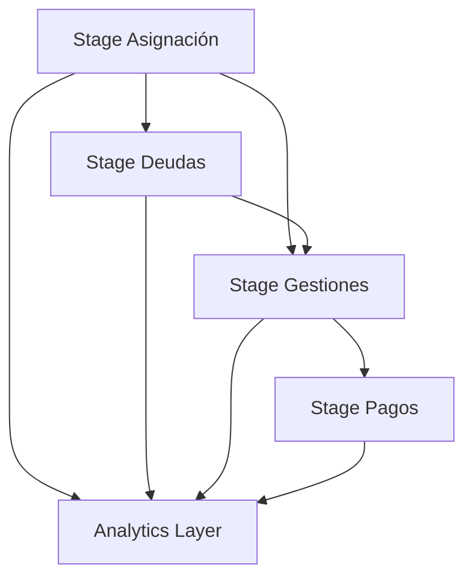

# Stages del Pipeline FACO

## 🏗️ Arquitectura de 3 Capas

El pipeline de gestión de cobranzas está estructurado en tres capas principales:

```
📁 stages/
├── 01_staging/          # Capa de Staging
├── 02_analytics/        # Capa Analítica  
└── 03_presentation/     # Capa de Presentación
```

## 🔄 Flujo de Datos

### 1️⃣ Staging Layer (01_staging)
**Propósito**: Ingesta, limpieza y estandarización de datos raw

- **✅ Asignación**: Procesamiento de datos de asignación de cartera
- **✅ Deudas**: Manejo de deudas diarias con lógica de apertura/subsiguiente
- **🔄 Gestiones**: Consolidación de actividades de gestión
- **📋 Pagos**: Normalización de información de pagos
- **📋 Calendarios**: Gestión de dimensiones temporales

### 2️⃣ Analytics Layer (02_analytics)
**Propósito**: Transformaciones de negocio y métricas calculadas

- **Indicadores**: KPIs y métricas de gestión
- **Segmentación**: Análisis de carteras y clientes
- **Tendencias**: Análisis temporal y forecasting
- **Cohorts**: Análisis de cohortes de recupero

### 3️⃣ Presentation Layer (03_presentation)
**Propósito**: Datos optimizados para consumo en herramientas de BI

- **Dashboards**: Vistas agregadas para Looker Studio
- **Reports**: Reportes predefinidos
- **APIs**: Endpoints para consumo externo
- **Exports**: Formatos para exportación

## 📋 Convenciones

### Nomenclatura
```
{capa}_{entidad}_{tipo}

Ejemplos:
- stg_asignacion (staging de asignación)
- stg_deudas (staging de deudas)
- anl_indicadores_recupero (analytics de indicadores)
- prs_dashboard_gestiones (presentation para dashboard)
```

### Estructura de Directorios
```
📁 {stage}/
├── 📁 {entidad}/
│   ├── 📄 sp_{entidad}.sql          # Stored Procedure principal
│   ├── 📄 create_table_{entidad}.sql # DDL de tabla
│   ├── 📁 tests/                    # Tests de calidad
│   ├── 📁 docs/                     # Documentación específica
│   └── 📁 examples/                 # Ejemplos de uso
```

## 🔑 Principios de Diseño

1. **Idempotencia**: Todos los procesos deben ser re-ejecutables
2. **Detección Automática**: Identificación inteligente de archivos por fecha
3. **Logging**: Registro completo de ejecuciones y métricas
4. **Testing**: Validación automática de calidad de datos
5. **Particionado**: Optimización para consultas temporales
6. **Documentación**: Especificaciones técnicas detalladas

## 🚀 Estado Actual

| Stage | Entidad | Estado | Funcionalidades | Prioridad |
|-------|---------|--------|-----------------|-----------|
| 01_staging | **asignacion** | ✅ **Completado** | Detección automática, merge inteligente, tests calidad | Alta |
| 01_staging | **deudas** | ✅ **Completado** | Lógica apertura/subsiguiente, construcción fechas, gestionabilidad | Alta |
| 01_staging | gestiones | 🔄 En desarrollo | Actividades de gestión y contactos | Alta |
| 01_staging | pagos | 📋 Planeado | Normalización de pagos y recuperos | Media |
| 02_analytics | indicadores | 📋 Planeado | KPIs de gestión y recupero | Alta |
| 03_presentation | dashboards | 📋 Planeado | Vistas para Looker Studio | Media |

## 🎯 Dependencias entre Stages

### Secuencia de Ejecución Recomendada


1. **Asignación** → Base de clientes asignados
2. **Deudas** → Requiere asignación para gestionabilidad
3. **Gestiones** → Sobre base de asignados y deudas
4. **Pagos** → Vinculado a gestiones realizadas

## 🔧 Funcionalidades Implementadas

### Stage de Asignación ✅
- **Detección automática** de archivos por fecha de proceso
- **Merge inteligente** con preservación de histórico
- **Enriquecimiento** con categorización de vencimiento
- **Tipificación** automática de cartera
- **Tests de calidad** automatizados

### Stage de Deudas ✅
- **Lógica compleja** día apertura vs subsiguiente
- **Construcción de fechas** desde nombres de archivo (TRAN_DEUDA_DDMM)
- **Filtrado inteligente** de clientes gestionables/medibles
- **Cálculo automático** de montos por reglas de negocio
- **Integración** con datos de asignación

## 📊 Métricas y Monitoreo

### Logging Centralizado
- **Tabla**: `BI_USA.pipeline_logs`
- **Métricas**: Registros procesados, duración, errores
- **Negocio**: Archivos detectados, tipos de activación, gestionabilidad

### Tests de Calidad
- **Asignación**: 5 tests automatizados
- **Deudas**: 8 tests específicos + métricas de negocio
- **Umbral**: 95% success rate mínimo

### Alertas Configuradas
- **Duración**: > 30 minutos
- **Volumen**: Variación > 50% vs promedio
- **Calidad**: Success rate < 95%
- **Negocio**: Sin archivos detectados, deudas medibles inconsistentes

## 🎮 Ejemplos de Uso

### Ejecución Diaria Automática
```sql
-- Procesa automáticamente asignación del día
CALL `BI_USA.bi_P3fV4dWNeMkN5RJMhV8e_sp_asignacion`();

-- Procesa automáticamente deudas del día (requiere asignación previa)
CALL `BI_USA.bi_P3fV4dWNeMkN5RJMhV8e_sp_deudas`();
```

### Pipeline Completo por Fecha
```sql
-- Pipeline completo para fecha específica
DECLARE fecha_proceso DATE DEFAULT '2025-06-19';

-- 1. Asignación
CALL `BI_USA.bi_P3fV4dWNeMkN5RJMhV8e_sp_asignacion`(fecha_proceso);

-- 2. Deudas (depende de asignación)
CALL `BI_USA.bi_P3fV4dWNeMkN5RJMhV8e_sp_deudas`(fecha_proceso);

-- 3. Gestiones (cuando esté disponible)
-- CALL `BI_USA.bi_P3fV4dWNeMkN5RJMhV8e_sp_gestiones`(fecha_proceso);
```

### Monitoreo de Resultados
```sql
-- Ver últimas ejecuciones
SELECT proceso, etapa, fecha_inicio, duracion_segundos, 
       registros_procesados, estado
FROM `BI_USA.pipeline_logs`
WHERE proceso = 'faco_pipeline'
ORDER BY fecha_inicio DESC
LIMIT 10;
```

## 🔍 Análisis de Datos

### Métricas de Asignación
```sql
SELECT 
  fecha_proceso,
  COUNT(*) as total_asignados,
  COUNT(DISTINCT cod_luna) as clientes_unicos,
  COUNT(DISTINCT tipo_cartera) as tipos_cartera,
  AVG(objetivo_recupero) as objetivo_promedio
FROM `BI_USA.bi_P3fV4dWNeMkN5RJMhV8e_stg_asignacion`
WHERE fecha_proceso >= DATE_SUB(CURRENT_DATE(), INTERVAL 7 DAY)
GROUP BY fecha_proceso
ORDER BY fecha_proceso DESC;
```

### Métricas de Deudas
```sql
SELECT 
  fecha_proceso,
  es_dia_apertura,
  COUNT(*) as total_deudas,
  SUM(monto_exigible) as monto_total,
  SUM(monto_gestionable) as monto_gestionable,
  SUM(monto_medible) as monto_medible,
  ROUND(AVG(CASE WHEN es_gestionable THEN 1.0 ELSE 0.0 END) * 100, 2) as pct_gestionable
FROM `BI_USA.bi_P3fV4dWNeMkN5RJMhV8e_stg_deudas`
WHERE fecha_proceso >= DATE_SUB(CURRENT_DATE(), INTERVAL 7 DAY)
GROUP BY fecha_proceso, es_dia_apertura
ORDER BY fecha_proceso DESC, es_dia_apertura DESC;
```

---

**Próximos Pasos**: 
1. ✅ ~~Finalizar stage de asignación~~
2. ✅ ~~Finalizar stage de deudas~~
3. 🔄 **Implementar stage de gestiones**
4. 📋 Configurar monitoreo automatizado
5. 📋 Desarrollar capa analítica

**Versión**: 1.2.0  
**Última actualización**: 2025-06-19
