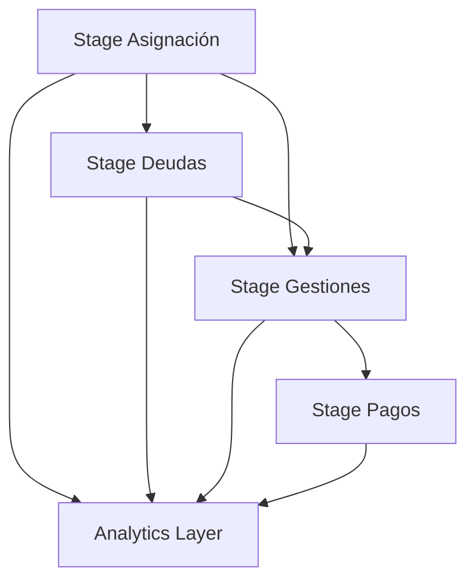

# Stages del Pipeline FACO

## 🏗️ Arquitectura de 3 Capas

El pipeline de gestión de cobranzas está estructurado en tres capas principales:

```
📁 stages/
├── 01_staging/          # Capa de Staging
├── 02_analytics/        # Capa Analítica  
└── 03_presentation/     # Capa de Presentación
```

## 🔄 Flujo de Datos

### 1️⃣ Staging Layer (01_staging)
**Propósito**: Ingesta, limpieza y estandarización de datos raw

- **✅ Asignación**: Procesamiento de datos de asignación de cartera
- **✅ Deudas**: Manejo de deudas diarias con lógica FECHA_TRANDEUDA
- **✅ Gestiones**: Unificación BOT + HUMANO con homologación completa
- **🔄 Pagos**: Normalización de información de pagos (en desarrollo)
- **📋 Calendarios**: Gestión de dimensiones temporales

### 2️⃣ Analytics Layer (02_analytics)
**Propósito**: Transformaciones de negocio y métricas calculadas

- **Indicadores**: KPIs y métricas de gestión
- **Segmentación**: Análisis de carteras y clientes
- **Tendencias**: Análisis temporal y forecasting
- **Cohorts**: Análisis de cohortes de recupero
- **Efectividad**: Métricas de performance por canal

### 3️⃣ Presentation Layer (03_presentation)
**Propósito**: Datos optimizados para consumo en herramientas de BI

- **Dashboards**: Vistas agregadas para Looker Studio
- **Reports**: Reportes predefinidos
- **APIs**: Endpoints para consumo externo
- **Exports**: Formatos para exportación

## 📋 Convenciones

### Nomenclatura
```
{capa}_{entidad}_{tipo}

Ejemplos:
- stg_asignacion (staging de asignación)
- stg_deudas (staging de deudas)
- stg_gestiones (staging de gestiones)
- anl_indicadores_recupero (analytics de indicadores)
- prs_dashboard_gestiones (presentation para dashboard)
```

### Estructura de Directorios
```
📁 {stage}/
├── 📁 {entidad}/
│   ├── 📄 sp_{entidad}.sql          # Stored Procedure principal
│   ├── 📄 create_table_{entidad}.sql # DDL de tabla
│   ├── 📁 tests/                    # Tests de calidad
│   ├── 📁 docs/                     # Documentación específica
│   └── 📁 examples/                 # Ejemplos de uso
```

## 🔑 Principios de Diseño

1. **Idempotencia**: Todos los procesos deben ser re-ejecutables
2. **Detección Automática**: Identificación inteligente de archivos y canales
3. **Homologación**: Estandarización de respuestas y operadores
4. **Logging**: Registro completo de ejecuciones y métricas
5. **Testing**: Validación automática de calidad de datos
6. **Particionado**: Optimización para consultas temporales
7. **Documentación**: Especificaciones técnicas detalladas

## 🚀 Estado Actual

| Stage | Entidad | Estado | Funcionalidades | Prioridad |
|-------|---------|--------|-----------------|-----------|
| 01_staging | **asignacion** | ✅ **Completado** | Detección automática, categorización, objetivos recupero | Alta |
| 01_staging | **deudas** | ✅ **Completado** | Lógica FECHA_TRANDEUDA, construcción fechas, medibilidad | Alta |
| 01_staging | **gestiones** | ✅ **Completado** | Unificación BOT+HUMANO, homologación, métricas efectividad | Alta |
| 01_staging | pagos | 🔄 En desarrollo | Normalización pagos y recuperos | Media |
| 02_analytics | indicadores | 📋 Planeado | KPIs de gestión y recupero | Alta |
| 03_presentation | dashboards | 📋 Planeado | Vistas para Looker Studio | Media |

## 🎯 Dependencias entre Stages

### Secuencia de Ejecución Obligatoria


1. **Asignación** → Base de clientes asignados
2. **Deudas** → Requiere asignación para gestionabilidad  
3. **Gestiones** → Sobre base de asignados y deudas para medibilidad
4. **Pagos** → Vinculado a gestiones realizadas

## 🔧 Funcionalidades Implementadas

### Stage de Asignación ✅
- **Detección automática** de archivos por fecha de proceso
- **Merge inteligente** con preservación de histórico
- **Enriquecimiento** con categorización de vencimiento
- **Tipificación** automática de cartera
- **Tests de calidad** automatizados (5 tests)

### Stage de Deudas ✅
- **Lógica específica** de medibilidad por FECHA_TRANDEUDA
- **Construcción de fechas** desde archivos TRAN_DEUDA_DDMM
- **Filtrado inteligente** de clientes gestionables/medibles
- **Cálculo automático** de montos por reglas de negocio
- **Tests de calidad** específicos (9 tests + validaciones)

### Stage de Gestiones ✅
- **Unificación BOT + HUMANO** con homologación completa
- **Métricas de efectividad** automáticas por canal
- **Secuencia de gestiones** con flags de análisis
- **Compromisos y conversión** con validación de montos
- **Tests de calidad** avanzados (10 tests + homologación)

## 📊 Métricas y Monitoreo

### Logging Centralizado
- **Tabla**: `BI_USA.pipeline_logs`
- **Métricas**: Registros procesados, duración, errores
- **Negocio**: Archivos detectados, medibilidad, efectividad, homologación

### Tests de Calidad por Stage
- **Asignación**: 5 tests automatizados
- **Deudas**: 9 tests específicos + validación FECHA_TRANDEUDA  
- **Gestiones**: 10 tests + análisis de homologación
- **Total**: 24 validaciones automáticas
- **Umbral**: 95% success rate mínimo

### Alertas Configuradas
- **Duración**: > 30 minutos
- **Volumen**: Variación > 50% vs promedio
- **Calidad**: Success rate < 95%
- **Negocio específico**: 
  - Sin archivos detectados
  - Deudas medibles inconsistentes
  - Baja homologación (< 80%)
  - Efectividad anormal

## 🎮 Ejemplos de Uso

### Pipeline Completo Diario
```sql
-- Secuencia completa automatizada
DECLARE fecha_proceso DATE DEFAULT CURRENT_DATE();

-- 1. Asignación (base)
CALL `BI_USA.bi_P3fV4dWNeMkN5RJMhV8e_sp_asignacion`(fecha_proceso);

-- 2. Deudas (requiere asignación)
CALL `BI_USA.bi_P3fV4dWNeMkN5RJMhV8e_sp_deudas`(fecha_proceso);

-- 3. Gestiones (requiere asignación y deudas)
CALL `BI_USA.bi_P3fV4dWNeMkN5RJMhV8e_sp_gestiones`(fecha_proceso);
```

### Ejecución por Stage Individual
```sql
-- Solo asignaciones
CALL `BI_USA.bi_P3fV4dWNeMkN5RJMhV8e_sp_asignacion`();

-- Solo deudas
CALL `BI_USA.bi_P3fV4dWNeMkN5RJMhV8e_sp_deudas`();

-- Solo gestiones BOT
CALL `BI_USA.bi_P3fV4dWNeMkN5RJMhV8e_sp_gestiones`(CURRENT_DATE(), 'BOT');
```

### Monitoreo de Resultados
```sql
-- Ver últimas ejecuciones de todos los stages
SELECT proceso, etapa, fecha_inicio, duracion_segundos, 
       registros_procesados, estado, observaciones
FROM `BI_USA.pipeline_logs`
WHERE proceso = 'faco_pipeline'
ORDER BY fecha_inicio DESC
LIMIT 10;
```

## 🔍 Análisis de Datos

### Métricas de Asignación
```sql
SELECT 
  fecha_proceso,
  COUNT(*) as total_asignados,
  COUNT(DISTINCT cod_luna) as clientes_unicos,
  COUNT(DISTINCT tipo_cartera) as tipos_cartera,
  AVG(objetivo_recupero) as objetivo_promedio
FROM `BI_USA.bi_P3fV4dWNeMkN5RJMhV8e_stg_asignacion`
WHERE fecha_proceso >= DATE_SUB(CURRENT_DATE(), INTERVAL 7 DAY)
GROUP BY fecha_proceso
ORDER BY fecha_proceso DESC;
```

### Métricas de Deudas
```sql
SELECT 
  fecha_proceso,
  COUNT(*) as total_deudas,
  SUM(monto_exigible) as monto_total,
  COUNT(CASE WHEN es_medible THEN 1 END) as medibles_trandeuda,
  SUM(monto_medible) as monto_medible,
  ROUND(COUNT(CASE WHEN fecha_trandeuda IS NOT NULL THEN 1 END) / COUNT(*) * 100, 2) as pct_cobertura_calendario
FROM `BI_USA.bi_P3fV4dWNeMkN5RJMhV8e_stg_deudas`
WHERE fecha_proceso >= DATE_SUB(CURRENT_DATE(), INTERVAL 7 DAY)
GROUP BY fecha_proceso
ORDER BY fecha_proceso DESC;
```

### Métricas de Gestiones
```sql
SELECT 
  fecha_proceso,
  canal_origen,
  COUNT(*) as total_gestiones,
  COUNT(CASE WHEN es_contacto_efectivo THEN 1 END) as efectivos,
  COUNT(CASE WHEN es_compromiso THEN 1 END) as compromisos,
  ROUND(COUNT(CASE WHEN es_contacto_efectivo THEN 1 END) / COUNT(*) * 100, 2) as pct_efectividad,
  ROUND(COUNT(CASE WHEN es_compromiso THEN 1 END) / COUNT(CASE WHEN es_contacto_efectivo THEN 1 END) * 100, 2) as pct_conversion
FROM `BI_USA.bi_P3fV4dWNeMkN5RJMhV8e_stg_gestiones`
WHERE fecha_proceso >= DATE_SUB(CURRENT_DATE(), INTERVAL 7 DAY)
GROUP BY fecha_proceso, canal_origen
ORDER BY fecha_proceso DESC, canal_origen;
```

## 📈 Lógica de Negocio Implementada

### Medibilidad (Deudas)
- **Regla**: Solo medible si `es_gestionable = TRUE` AND `fecha_deuda = FECHA_TRANDEUDA`
- **Join crítico**: Por FECHA_TRANDEUDA, no por FECHA_ASIGNACION
- **Resultado**: Precisión en clientes que cuentan para competencia

### Homologación (Gestiones)
- **BOT**: Por `management + sub_management + compromiso`
- **HUMANO**: Por `management` y `nombre_agente`
- **Resultado**: Respuestas unificadas en `grupo_respuesta`, `nivel_1`, `nivel_2`

### Efectividad (Gestiones)
- **Contacto Efectivo**: Patterns `%CONTACTO_EFECTIVO%`, `%EFECTIVO%`
- **Compromiso**: Flag PDP homologado + validación montos
- **Conversión**: % Compromisos / Contactos Efectivos

---

**Próximos Pasos**: 
1. ✅ ~~Finalizar stage de asignación~~
2. ✅ ~~Finalizar stage de deudas con lógica FECHA_TRANDEUDA~~
3. ✅ ~~Finalizar stage de gestiones con unificación BOT+HUMANO~~
4. 🔄 **Implementar stage de pagos**
5. 📋 Desarrollar capa analítica
6. 📋 Configurar dashboards en Looker Studio

**Versión**: 1.3.0  
**Última actualización**: 2025-06-19  
**Estado**: 3/4 stages de staging completados (75%)
